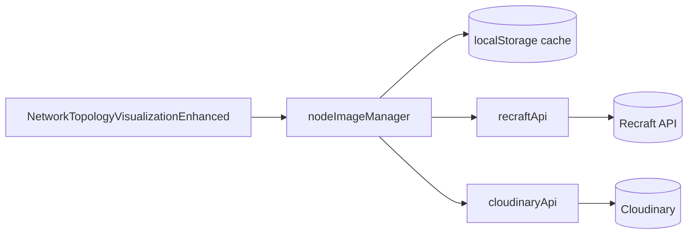

# Image Generation - Quick Reference Guide

## What Was Fixed

The Network Topology screen was showing 404 errors for node images. The system now automatically generates and uploads SVG images when they're missing.

## Key Changes

| Component | Change | Impact |
|-----------|--------|--------|
| `imageExistsInCloudinary()` | Image object loading instead of HEAD requests | More reliable detection |
| `getNodeImage()` | Added `autoGenerate` parameter | Can trigger generation |
| `uploadImageToCloudinary()` | Better error handling and logging | More robust uploads |
| `loadImages()` | Auto-generates up to 5 images per load | Automatic image generation |
| All APIs | Added comprehensive logging | Easier debugging |

## How It Works Now

```
1. Visualization loads
2. For each node:
   a. Check if image exists in cache/Cloudinary
   b. If exists → Use it
   c. If missing AND count < 5 → Generate it
   d. If generated → Upload to Cloudinary
   e. Cache the result
3. Display images in visualization
```

### Auto-Generation Logic (Diagram)

```mermaid
flowchart TD
  A[Visualization loads] --> B{Node image in cache?}
  B -- Yes --> Z[Render node with cached image URL]
  B -- No --> C{Image exists in Cloudinary?}
  C -- Yes --> D[Use Cloudinary URL]
  D --> E[Cache URL]
  E --> Z
  C -- No --> F{Auto-generate limit\n(< 5 per load)?}
  F -- No --> G[Render fallback icon\n(colored circle)]
  F -- Yes --> H[Generate SVG via Recraft]
  H --> I[Upload to Cloudinary]
  I --> J[Cache URL]
  J --> Z
```

### Component Relationships (Diagram)



## Testing Checklist

- [ ] Open Network Topology dashboard
- [ ] Open DevTools Console (F12)
- [ ] Look for "Auto-generating image for node" messages
- [ ] Verify images appear in visualization
- [ ] Check Cloudinary Media Library for uploaded images
- [ ] Refresh page and verify images load from cache
- [ ] No 404 errors in console

## Console Logs to Expect

```
Auto-generating image for node node-047 (1/5)
Generating image for node: East Coast Gateway (type: gateway)
Generating network device SVG for East Coast Gateway (type: gateway)
Calling Recraft API with prompt: Create high-resolution SVG icon...
Recraft API response: {...}
Generated image URL for East Coast Gateway: https://...
Uploading to Cloudinary with publicId: tmobile/network-nodes/node-047_east_coast_gateway
Uploading image to Cloudinary: tmobile/network-nodes/node-047_east_coast_gateway from https://...
Successfully uploaded image to Cloudinary: tmobile/network-nodes/node-047_east_coast_gateway
Successfully uploaded and cached image for East Coast Gateway: https://res.cloudinary.com/...
Loaded 50 node images (5 auto-generated)
```

## Environment Variables Required

```
VITE_CLOUDINARY_CLOUD_NAME=your_cloudinary_cloud_name
VITE_CLOUDINARY_API_KEY=your_cloudinary_api_key
VITE_CLOUDINARY_API_SECRET=your_cloudinary_api_secret
VITE_RECRAFT_API_URL=https://external.api.recraft.ai/v1
VITE_RECRAFT_API_KEY=<your_key>
```

## Files Modified

1. `src/lib/cloudinaryApi.js` - Image upload and existence check
2. `src/lib/nodeImageManager.js` - Image retrieval and generation
3. `src/lib/recraftApi.js` - API logging
4. `src/components/NetworkTopologyVisualizationEnhanced.jsx` - Image loading

## API Calls Made

### Recraft API
- **Endpoint**: `https://external.api.recraft.ai/v1/images/generations`
- **Method**: POST
- **Purpose**: Generate SVG images
- **Rate**: Limited to 5 per visualization load

### Cloudinary API
- **Endpoint**: `https://api.cloudinary.com/v1_1/<cloud_name>/image/upload`
- **Method**: POST
- **Purpose**: Upload generated images
- **Rate**: Limited to 5 per visualization load

## Troubleshooting

### No images are being generated
**Check**:
- Console shows "Recraft API not configured" → Check VITE_RECRAFT_API_KEY
- Console shows "Cloudinary not configured" → Check VITE_CLOUDINARY_CLOUD_NAME
- No Recraft API calls in Network tab → Check API key validity

### Images generated but not uploaded
**Check**:
- Console shows "Cloudinary upload error" → Check credentials
- Network tab shows failed requests to api.cloudinary.com → Check API key
- Verify upload preset exists or API key is valid

### Images uploaded but not displaying
**Check**:
- Verify URLs in Cloudinary Media Library are accessible
- Check if CORS is blocking image loads
- Try accessing image URL directly in browser
- Check browser console for image load errors

### Timeout errors
**Check**:
- Network connectivity to Recraft API
- Network connectivity to Cloudinary
- API rate limits (may need to add delays)

## Manual Image Generation

For generating all node images at once:
1. Click "Generate Node Images" button
2. Verify configuration (Recraft and Cloudinary should be Connected)
3. Click "Generate Images"
4. Monitor progress bar
5. Wait for completion message

## Performance Notes

- **Auto-generation**: Limited to 5 images per load
- **Caching**: Images cached in localStorage
- **Optimization**: Images optimized to 64x64 pixels
- **Fallback**: Visualization works with colored circles if images fail

## Rate Limiting

- **Per Load**: Maximum 5 auto-generated images
- **Reason**: Prevent overwhelming APIs
- **Manual**: Use "Generate Node Images" button for all nodes

## Caching

- **Location**: Browser localStorage
- **Key**: `tmobile_node_images_cache`
- **Clear**: Use "Clear Cache" button in Node Image Generator dialog
- **Persist**: Survives page reloads

## Image Sizes

- **Normal**: 24x24 pixels
- **Hovered**: 24x24 pixels (opacity change)
- **Selected**: 32x32 pixels
- **Alarmed**: 28x28 pixels (with glow effect)

## Cloudinary Folder Structure

```
tmobile/
└── network-nodes/
    ├── node-047_east_coast_gateway
    ├── node-048_west_coast_gateway
    ├── node-049_primary_firewall
    └── ... (more nodes)
```

## API Response Format

### Recraft API Response
```json
{
  "data": [
    {
      "url": "https://...",
      "revised_prompt": "..."
    }
  ]
}
```

### Cloudinary Upload Response
```json
{
  "public_id": "tmobile/network-nodes/node-047_east_coast_gateway",
  "secure_url": "https://res.cloudinary.com/...",
  "url": "http://res.cloudinary.com/...",
  ...
}
```

## Backward Compatibility

- ✓ Existing code still works
- ✓ No breaking changes
- ✓ New features are opt-in
- ✓ Visualization automatically uses new workflow

## Documentation Files

1. **IMAGE_GENERATION_FIXES_SUMMARY.md** - Detailed fix summary
2. **IMAGE_GENERATION_DEBUG_GUIDE.md** - Debugging guide
3. **IMAGE_GENERATION_TEST_CASES.md** - 10 test cases
4. **NETWORK_TOPOLOGY_IMAGE_GENERATION_COMPLETE.md** - Complete report
5. **IMAGE_GENERATION_QUICK_REFERENCE.md** - This file

## Support Resources

- Check console logs for error messages
- Review debug guide for troubleshooting
- Run test cases to verify functionality
- Check Cloudinary dashboard for uploaded images
- Verify environment variables are set correctly

