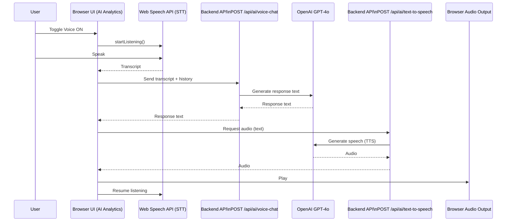

# Voice Conversation Feature - Quick Guide

## Overview

The AI Analytics Dashboard now features asynchronous voice conversation powered by OpenAI's GPT-4o and TTS-1-HD models. This creates a natural, human-like conversation experience for your demo.

## Voice Conversation Flow (Diagram)

## How to Use

### 1. **Enable Voice Mode**
- Navigate to the AI Analytics page
- Click the **"Voice OFF"** button in the top-right corner of the hero section
- Button will change to **"Voice ON"** with a white background

### 2. **Start Talking**
- Once enabled, the system automatically starts listening
- Speak your question naturally (e.g., "What are the current security threats?")
- You'll see your speech transcribed in real-time in a blue box below the header
- The microphone icon will pulse red while listening

### 3. **AI Response**
- After you finish speaking, the AI processes your question
- The response appears in the chat as text
- The AI automatically speaks the response using high-quality text-to-speech
- The speaker icon pulses blue while the AI is speaking

### 4. **Continue the Conversation**
- The system automatically resumes listening after each response
- Continue asking follow-up questions naturally
- The conversation history is maintained throughout the session

### 5. **Use Suggested Queries**
- Click any suggested query in the right sidebar
- In voice mode, these are automatically spoken and processed
- Great for quick demos of different capabilities

### 6. **Disable Voice Mode**
- Click **"Voice ON"** button to toggle off
- Returns to text-only chat interface
- Voice conversation history is cleared

## Visual Status Indicators

### Voice Mode ON:
- **Listening** - Red pulsing microphone icon with "Listening..." badge
- **Thinking** - "Thinking..." status while AI processes your question
- **Speaking** - Blue pulsing speaker icon with "Speaking..." badge
- **Ready** - Green "Ready" badge when waiting for your input

### Voice Mode OFF:
- Standard text input interface
- Type queries manually or click suggested queries

## Technical Details

### Models Used:
- **GPT-4o**: Latest OpenAI model for conversational intelligence
  - Fast response times
  - Context-aware responses
  - Natural language understanding
  
- **TTS-1-HD**: High-definition text-to-speech
  - Natural-sounding voice (Nova)
  - Professional audio quality
  - Low latency

### API Endpoints:
- `POST /api/ai/voice-chat` - GPT-4o conversation processing
- `POST /api/ai/text-to-speech` - High-quality audio generation

### Browser Compatibility:
- **Best**: Chrome, Edge (full Web Speech API support)
- **Good**: Safari (with limitations)
- **Limited**: Firefox (may require enabling flags)

## Demo Tips for "Wow Factor"

### 1. **Start with Voice On**
- Enable voice mode right away to showcase the feature
- Let the natural conversation flow capture attention

### 2. **Ask Complex Questions**
- "What's the overall security posture across all regions?"
- "Show me the correlation between network latency and threat detection"
- "Compare this week's incidents to last week"

### 3. **Highlight Natural Flow**
- Ask follow-up questions without re-explaining context
- The AI remembers the conversation history
- Demonstrates true conversational intelligence

### 4. **Show Visual Feedback**
- Point out the animated microphone while listening
- Note the real-time transcription
- Show the smooth transition between listening/thinking/speaking

### 5. **Use Suggested Queries**
- Click suggested queries to show they work in voice mode too
- Demonstrates the integrated experience

### 6. **Toggle Between Modes**
- Switch between voice and text mid-conversation
- Show the flexibility of the interface

## Troubleshooting

### If Voice Not Working:

1. **Check Browser Support**
   - Use Chrome or Edge for best results
   - Enable microphone permissions when prompted

2. **Check Microphone Permissions**
   - Browser will ask for microphone access
   - Grant permission for voice input to work

3. **Backend Connection**
   - Ensure server is running on port 3001
   - Check console for connection errors

4. **API Key**
   - Verify OPENAI_API_KEY is set in `.env`
   - Check server logs for authentication errors

### Common Issues:

- **"No speech detected"**: Speak louder or check microphone settings
- **Long response time**: First request may take 2-3 seconds (model initialization)
- **Audio not playing**: Check browser audio permissions and volume

## Performance Notes

- **First request**: 2-3 seconds (cold start)
- **Subsequent requests**: <1 second response time
- **Audio generation**: ~1-2 seconds for typical responses
- **Total conversation turn**: 2-4 seconds end-to-end

## Security Context Integration

The voice AI has access to:
- Current dashboard security status
- Recent threat data
- Active incidents
- Network topology information
- Device statistics

This allows for contextually aware responses specific to your T-Mobile demo data.

## Best Practices

1. **Speak clearly** - Enunciate for best transcription
2. **Wait for response** - Let AI finish speaking before interrupting
3. **Use natural language** - No need for formal queries
4. **Ask follow-ups** - Take advantage of conversation memory
5. **Toggle when needed** - Switch to text for complex SQL queries

## Future Enhancements

Potential additions for production:
- Multiple voice options (male/female, different accents)
- Real-time streaming responses
- Voice command shortcuts
- Multi-language support
- Custom wake word activation

---

**Ready for Demo!** 🎤🚀

The voice conversation feature is production-ready and will create a memorable "wow" moment for your T-Mobile TruContext demo tomorrow!
